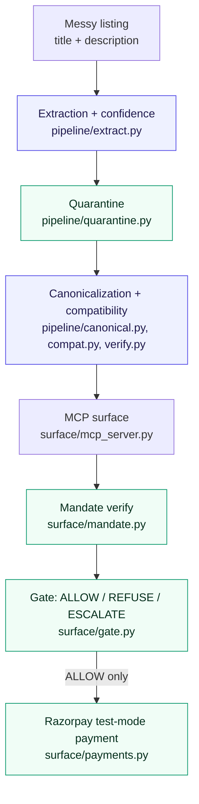

# AgentFront — the Merchant Agent-Readiness Engine

Razorpay AI Buildathon 2026, Track 1 (AI Growth & Agentic Commerce).

**Agent payment rails are being built. Merchant catalogs are not ready for them.** A real
catalog is prose written for a human — inconsistent titles, no structured attributes, no
compatibility data — and an AI buyer agent cannot reliably transact against that. AgentFront
ingests a merchant's existing messy catalog and generates their complete agent-commerce
surface: structured attributes with honest confidence, a verified compatibility graph, MCP
tool endpoints, an AP2-style mandate chain, and a gated payment path on Razorpay test mode —
then proves the surface actually helps, with a real before/after experiment, not a claim.

## The headline results

Same scripted buyer agent, same 40 real purchase intents, run twice — once against the raw
60-SKU catalog, once against the generated surface:

| Metric | Raw catalog | Generated surface |
|---|---|---|
| Completion rate | 75% (30/40) | **100%** (40/40) |
| Wrong-item rate | 5% (2/40) | **0%** (0/40) |
| Dead-end rate | 20% (8/40) | **0%** (0/40) |

Extraction quality, scored against a held-out, human-verified label set (never tuned against):

| Field | Support | Precision | Recall | F1 |
|---|---|---|---|---|
| Accessory type (the master gating field) | 18 | 1.00 | 1.00 | 1.00 |
| Connector type | 8 | 1.00 | 1.00 | 1.00 |
| Model compatibility | 13 | 0.64 | 0.69 | 0.67 |
| Material | 5 | 0.43 | 0.60 | 0.50 |

Macro-F1 across these four reportable fields: **0.79**. (Four more fields had too few
labeled examples — 0, 0, 1, 2 — to report a trustworthy percentage on; see "What we are not
claiming" below.)

Independent adversarial red-team (a different model, shown only the black-box MCP surface,
zero sight of `gate.py` / `mandate.py` / `refusal.py`): **13 attacks executed for real** (5
against the mandate/gate stack, 8 catalog-injection attempts against extraction) →
**2 real vulnerabilities found, both fixed with regression tests, both re-verified live**.
Full writeup, including the ones we initially got wrong before catching it ourselves:
[`docs/what-broke.md`](docs/what-broke.md).

267 automated tests pass against real Redis and real Ed25519 crypto (LLM calls mocked, ~9s).

## What's built

The AI core (extraction + confidence, canonicalization, compatibility proposal +
verification, quarantine), the full transaction surface (AP2 mandate verify/issue,
deterministic gate, idempotency, 13-code refusal taxonomy, Razorpay test-mode payments, MCP
server), the before/after growth harness, and the adversarial red-team have all been run for
real against the real 60-SKU catalog, with results committed under `eval/`.

A 6-screen frontend (`frontend/`) demos the whole thing: Extraction, Surface, Agent mode,
Refusal gallery, Injection demo, Results. It defaults to replaying real, committed results
client-side (works with zero API keys, zero backend, cannot fail mid-recording) and
additively upgrades to a live backend (`api/`, `docker compose up -d`) when reachable —
every live call has a genuine cached fallback, verified by actually stopping the backend and
confirming nothing breaks.

## Architecture



Blue = an LLM proposes something here. Green = deterministic code has the final say, with
**zero LLM imports** — see below.

Full writeup of the AP2 mandate chain, which half of it is ours, and where NPCI's UAP fits:
[`docs/architecture.md`](docs/architecture.md).

## "AI proposes, code verifies" — structurally, not just claimed

The rule: **the LLM does hard inference; deterministic code does money, and verifies every
LLM claim before it can affect a transaction.** This isn't a design doc promise — it's
enforced literally. These four files contain **zero LLM imports**, checked, not assumed:

- `surface/gate.py` — ALLOW / REFUSE(code) / ESCALATE, pure function, no I/O
- `surface/mandate.py` — Intent Mandate verification, Cart Mandate issuance
- `pipeline/verify.py` — checks an LLM-proposed compatibility edge against a SKU's own
  already-extracted attributes
- `pipeline/quarantine.py` — confidence-gated publish decision; `accessory_type` gates
  whether anything else about a SKU is safe to publish

Check it yourself — this is the actual command, not a paraphrase:

```bash
grep -niE "langchain|google\.generativeai|genai|groq|import openai" \
  surface/gate.py surface/mandate.py pipeline/verify.py pipeline/quarantine.py
# -> no output. Nothing to grep means nothing to trust on faith.
```

## Quickstart

Verified from a genuinely clean clone into a fresh temp directory before this was written
down.

```bash
git clone <this repo> && cd agentfront
python -m venv .venv && source .venv/Scripts/activate   # Windows: .venv\Scripts\activate
pip install -e ".[dev]"

cp .env.example .env
# Required even to run the test suite: an Ed25519 signing seed.
python -c "import nacl.signing,binascii; print(binascii.hexlify(nacl.signing.SigningKey.generate()._seed).decode())"
# -> paste the output as MANDATE_SIGNING_SEED=... in .env

docker compose up -d     # Postgres + Redis + the API layer, together, one command
pytest -m "not llm"      # 267 passed, 6 deselected -- no API keys needed
```

Frontend (separate terminal):

```bash
cd frontend && npm install && npm run dev
# -> http://localhost:5173/
```

No `GOOGLE_API_KEY` / `GROQ_API_KEY` / `RAZORPAY_KEY_ID` needed for any of the above — the
full test suite and the full frontend demo run against real Redis and real, committed data,
with every LLM/Razorpay call either mocked, cached, or gracefully degraded without a key.

### What runs right now with zero API keys

```bash
python -c "from surface.mcp_server import search_catalog; import json; print(json.dumps(search_catalog(category='charger'), indent=2))"
cat eval/extraction_results.json              # 60/60 SKUs, per-field confidence + quarantine
cat eval/growth_ab_results.json               # the before/after numbers above, raw
cat eval/adversarial/adversarial_results.json # the red-team run, raw
pytest -m "not llm"
```

### What needs API keys

`GOOGLE_API_KEY` and/or `GROQ_API_KEY` in `.env` to re-run any LLM stage for real (see
`pipeline/llm_config.py` for exactly which component uses which provider, and why two
providers — Gemini for careful extraction/canonicalization, Groq for fast high-volume
adversarial generation). `RAZORPAY_KEY_ID` / `RAZORPAY_KEY_SECRET` (test-mode, `rzp_test_...`
only — `surface/payments.py` refuses anything else) for `scripts/razorpay_smoke.py`.

## What we are NOT claiming

- **Not yet a general "any merchant" engine.** The money/trust layer (`surface/mandate.py`,
  `gate.py`, `idempotency.py`, `refusal.py`, `payments.py`) doesn't reference phone
  accessories anywhere and would carry over as-is. The extraction schema, the quarantine
  gate field, and the compatibility logic are currently scoped to this one vertical (phone
  accessories, 60 real SKUs) — depth over breadth, a scope decision, not a hidden gap.
- **Razorpay capture is verified for order creation only.** Capture requires a human to
  complete Razorpay's hosted checkout; there's no server-to-server auto-pay path on this test
  account (both UPI Collect S2S and generic S2S JSON returned 404). Capture/reconciliation
  logic is tested against a realistic fake client, not yet a real captured payment. See
  `docs/what-broke.md`'s payments entry.
- **A fourth growth metric (agent basket value / bundling) was cut for time**, not measured —
  the three metrics reported above are complete and real on their own.
- **Model-compatibility extraction (0.67 F1) is a real, acknowledged weak field**, not hidden
  behind a rounded-up average. The same real phone model gets spelled several different ways
  across a messy catalog; matching close-enough spellings correctly is a genuinely hard
  problem, and `pipeline/canonical.py`'s clustering (embeddings propose, an LLM adjudicates,
  a deterministic rule vetoes transitive contradictions) is the part of this build most
  directly aimed at it.

## What actually broke, and how we caught it

Every real bug this project found in its own tooling — extraction, the payment gate, the
canonicalization agent, the adversarial harness itself — including the ones we got wrong on
the first fix. Not a changelog; a record, kept because a clean result is not automatically a
correct one. [`docs/what-broke.md`](docs/what-broke.md).

## Repo layout

```
/pipeline/          the AI core
  extract.py         attribute extraction + per-attribute confidence, batched, disk-cached
  canonical.py       model_compat canonicalization: embedding clustering + LLM adjudication
  compat.py          LLM proposes compatibility edges from raw text
  verify.py          code VERIFIES proposals -- NO LLM IMPORTS
  quarantine.py      confidence-gated publish decision -- NO LLM IMPORTS
  llm_config.py / llm_clients.py   provider routing, fallback chains
/surface/           generated per merchant
  mandate.py         AP2 intent verify + cart mandate issue -- NO LLM IMPORTS
  gate.py            ALLOW / REFUSE(code) / ESCALATE, pure function -- NO LLM IMPORTS
  refusal.py         structured refusal taxonomy (13 codes, see docs/refusal_codes.md)
  idempotency.py     Redis, keyed on hash(intent_mandate_id + cart_hash)
  payments.py        Razorpay test-mode order/capture, strictly behind the gate
  mcp_server.py      search / get_product / check_availability / create_cart_mandate / ...
/api/               additive live layer -- health, refusal scenarios, injection demo,
                    single-SKU extraction, all fallback-safe to cached data
/eval/
  ground_truth/      hand-labelled, held-out, NEVER tuned against
  extraction_eval.py    precision / recall / F1 per attribute
  growth_ab.py          before/after harness -- raw catalog vs. generated surface
  adversarial/           independently generated attacks + real execution against the stack
  *.json                 committed results from real runs -- see "zero API keys" above
/data/              raw source (public dataset) + curated data/catalog.json
/scripts/           one-off / operational scripts (catalog curation, Razorpay smoke test)
/tests/             pytest suite -- mocked LLM calls, real Redis, real Ed25519 crypto
/docs/              architecture, what actually broke, refusal code table, build plan
/frontend/          React + TS + Tailwind, 6 screens, replays committed data by default,
                    upgrades to the live api/ layer when reachable
```
